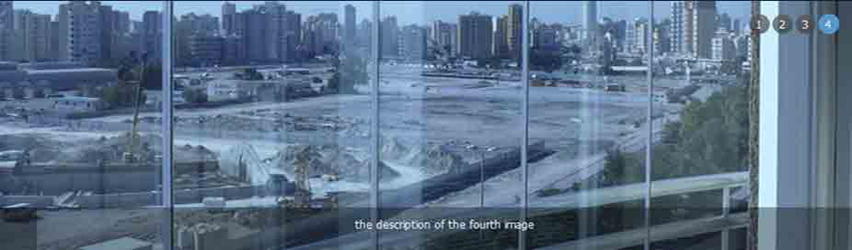
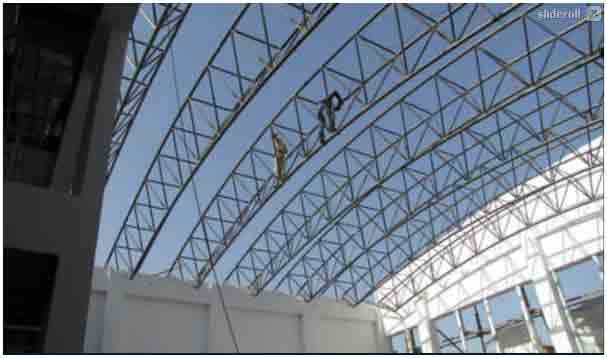

<!DOCTYPE html PUBLIC "-//W3C//DTD XHTML 1.0 Transitional//EN" "http://www.w3.org/TR/xhtml1/DTD/xhtml1-transitional.dtd">
<html xmlns="http://www.w3.org/1999/xhtml">
<head>
<meta http-equiv="Content-Type" content="text/html; charset=utf-8" />
<title>shields systems</title>
<link href="css/reset-min.css" rel="stylesheet" type="text/css" />
<link href="css/fonts-min.css" rel="stylesheet" type="text/css" />
<link href="css/style.css" rel="stylesheet" type="text/css" />
</head>

<body>
<!--start-->

<!--start-->
    

            

                

                 

                
                

                <h1>latest news</h1>
                 

    
    just fayjust fayjust fayjust fayjustjust fayjust fayjust fayjust fayjust fayjust
    just 
    just  fayjust fayjust fayjust fayjustjust fayjust fayjust fayjust fayjust fayjust

                 <a href="www.#.com">Red more</a>
                 

            

            <!--end-->
            
            <!--start-->
    

        <ul>  
            <li><a href="">Home</a></li>
            <li><a href="">About</a></li>
            <li><a href="">Services</a>
            	<ul>
                	<li><a href="">Home</a></li>
                    <li><a href="">Home</a></li>
                    <li><a href="">Home</a></li>
                    <li><a href="">Home</a></li>
                    <li><a href="">Home</a></li>
                    <li><a href="">Home</a></li>
                </ul>
            </li>
            <li><a href="">Projects</a></li>
            <li><a href="">Contact Us</a></li>
        </ul>
    

    <!--end-->
    
    

     
    

    <!--start-->
        

            

            <h1>Parking System</h1>
            
SYSTEM OF MOVABLE GLASS PANELS WITHOUT FLOOR GUIDE
The system secures with bolts between the panels and internal mechanical lock locking (where required). The weather proofing of the construction is achieved with the use of brush.

            <a href="">more&raquo;</a>
            

            

            <h1>Parking System</h1>
            
SYSTEM OF MOVABLE GLASS PANELS WITHOUT FLOOR GUIDE
The system secures with bolts between the panels and internal mechanical lock locking (where required). The weather proofing of the construction is achieved with the use of brush.

            <a href="">more&raquo;</a>
            

            

            <h1>Parking System</h1>
            
SYSTEM OF MOVABLE GLASS PANELS WITHOUT FLOOR GUIDE
The system secures with bolts between the panels and internal mechanical lock locking (where required). The weather proofing of the construction is achieved with the use of brush.

            <a href="">more&raquo;</a>
            

            
            

        

    <!--end-->
    

<!--start-->
    

    
        

        <!--start-->
        

        <h1>lates projects</h1>
        
           

            	<h3>March, 2010</h3>
                <h2>Parking System</h2>
                
SYSTEM OF MOVABLE GLASS PANELS WITHOUT FLOOR GUIDE The system secures with bolts between the panels and internal mechanical. 

               
            

            

            	<h3>March, 2010</h3>
                <h2>Parking System</h2>
                
SYSTEM OF MOVABLE GLASS PANELS WITHOUT FLOOR GUIDE The system secures with bolts between the panels and internal mechanical. 

               
            

            

            	<h3>March, 2010</h3>
                <h2>Parking System</h2>
                
SYSTEM OF MOVABLE GLASS PANELS WITHOUT FLOOR GUIDE The system secures with bolts between the panels and internal mechanical. 

               
            

            

            	<h3>March, 2010</h3>
                <h2>Parking System</h2>
                
SYSTEM OF MOVABLE GLASS PANELS WITHOUT FLOOR GUIDE The system secures with bolts between the panels and internal mechanical. 

             
            

            

            	<h3>March, 2010</h3>
                <h2>Parking System</h2>
                
SYSTEM OF MOVABLE GLASS PANELS WITHOUT FLOOR GUIDE The system secures with bolts between the panels and internal mechanical. 

              
            

            

            	<h3>March, 2010</h3>
              <h2>Parking System</h2>

SYSTEM OF MOVABLE GLASS PANELS WITHOUT FLOOR GUIDE The system secures with bolts between the panels and internal mechanical. 

            

          

  
      <!--start-->     
        

        <h1>Latest Project - finished on 1/4/2011</h1>
        
         

         

        <h1>Latest Project - finished on 1/4/2011</h1>
        
         

         

        <h1>Latest Project - finished on 1/4/2011</h1>
        
        

      <!--end-->
                 
            
            <!------->
        

      
    
    

     
<!--end-->
<!--start-->
 <!------->
 

 
        

        
            

            <h1>partners</h1>
            
        <h2>INAL - From Greece</h2>
            
Experts in the production and
        application of building industrial 
        equipment and offers a wide range of high quality products.

            <a h href="">more</a>
                    

                    
                    

                    <h1>partners</h1>
                    
                    <h2>INAL - From Greece</h2>
                    
Experts in the production and
                application of building industrial 
                equipment and offers a wide range of high quality products.

                    <a h href="">more</a>
                    

                    
                    

                    <h1>partners</h1>
                    
                    <h2>INAL - From Greece</h2>
                    
Experts in the production and
                application of building industrial 
                equipment and offers a wide range of high quality products.

                    <a h href="">more</a>
                    

                    
            

  
   
 

   		 

                        <h3> Send instant Message!</h3>
   <form action="http://www.shields-systems.com/send.php" method="post">
                            <h6>Your Name   :</h6> 
   <input type="text" name="name" onfocus="this.value=''" value="write your name here!" style="color:#999" width="200">   
                            <h6>Company       :</h6>
   <input type="text" name="co" onfocus="this.value=''" value="write your company name" style="color:#999" width="200">   
                            <h6>Your e-mail :</h6>
   <input type="text" name="email"  placeholder="write your e-mail address" style="color:#999" width="200">   
                            <h6>Subject		:</h6>
   <input type="text" name="subject" onfocus="this.value=''" value="Message subject here!" style="color:#999" width="200" align="right"> 
   
<textarea name="details"  placeholder="Write Your Message Here! "></textarea>

   
   <input type="submit" name="Submit" value="Send Message" style="margin-top: 15px; background:url(image/send.png) no-repeat width: 114px; height: 28px;">
   
    </form>
    
    		

            
 

 
  
  <!------>  
<!--end-->

<!--start-->

<h1>Home | About us | products & Services | Projects | Contact Us</h1>
  

Copyright © 2011 − Shields Systems ; 
Designed & developed by : KWEWeb Integrated Web Solutions

<!--end-->

</body>
</html>
